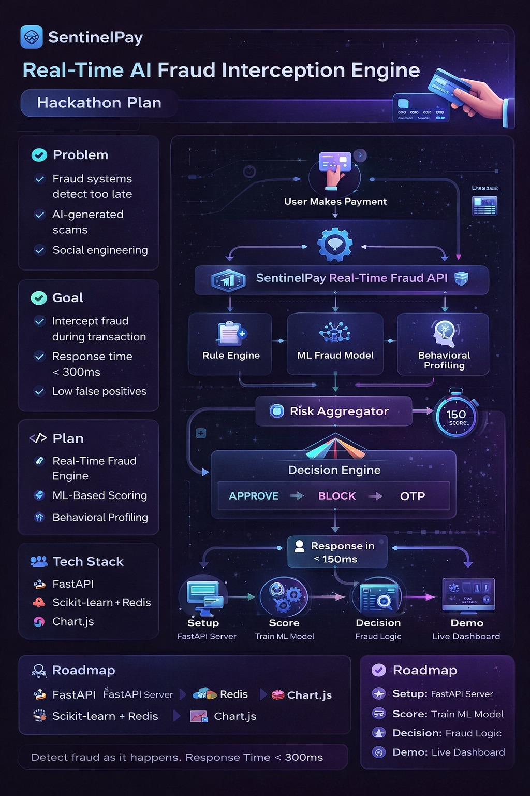

# BWT_TEAM_TITANIC
This is a hackathon repo created for TRAE Hackathon

Fraud detection systems often detect suspicious activity after the money has already moved.

Modern fraudsters use:

AI-generated scams

Social engineering

New devices & synthetic identities

Current systems:

Detect too late

Have high false positives

Lack real-time behavioral intelligence
SentinelPay is a simulated real-time fraud detection engine that intercepts digital transactions in <300ms using a hybrid intelligence approach combining:
🧠 Machine Learning risk scoring

📊 Behavioral anomaly detection

⚙️ Rule-based risk signals

🔎 Explainable AI decisioning

📈 Live monitoring dashboard
Backend:

FastAPI (Python)

Scikit-learn

Redis (behavior store)

Frontend:

React / HTML Dashboard

Chart.js

Data:

Credit Card Fraud Dataset (simulated)

